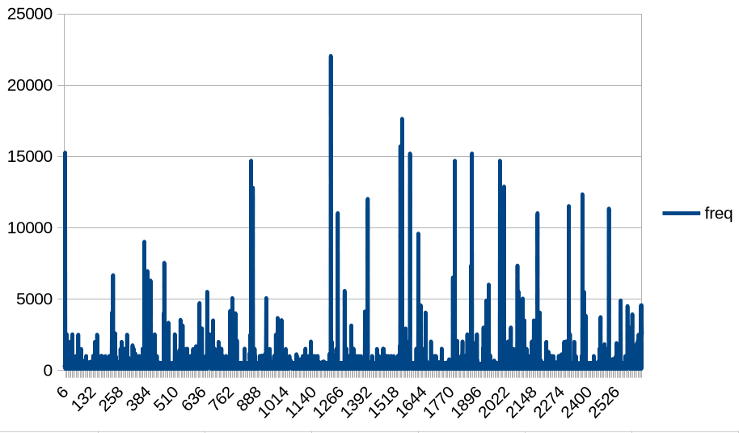
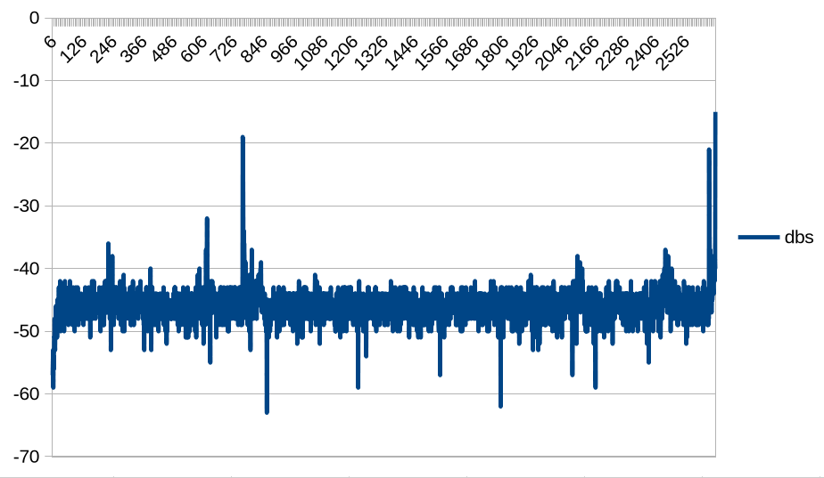

# Noise Hunter

```bash
❯❯❯ python3 noise-hunter.py --help
usage: noise-hunter.py [-h] [-fl FL] [-fh FH] [-efl EFL] [-efh EFH] [-dl DL] [-dh DH] [-p] [--save-csv SAVE_CSV] [-o OUT] [-w]

options:
  -h, --help           show this help message and exit
  -fl FL               bandpass lowcut and filter by frequency range, ie: -fl 100 -fh 300
  -fh FH               bandpass highcut and filter by frequency range, ie: -fl 100 -fh 300
  -efl EFL             exclude frequency range, ie: -efl 1 -efh 100.01
  -efh EFH             exclude by frequency range, ie: -efl 1 -efh 100.01
  -dl DL               filter by decibels range, ie: -dl -30 -dh -20
  -dh DH               filter by decibels range, ie: -dl -30 -dh -20
  -p, --plot           Draw a plot to see the wave
  --save-csv SAVE_CSV  save metrics in csv: --save-csv file.csv
  -o, --out OUT        save filtered noise to wav when control+C is pressed: -o file.wav
  -w, --white          create white noise in loop, must be combined with a freq filter
  -t, --tag            discard all the noises with no tag classification
```

## Examples

```
❯❯❯ python3 noise-hunter.py
detected 115.14Hz -55dBs rms:0.0007 amp range:[-0.0018, 0.0013]
detected 115.14Hz -54dBs rms:0.0006 amp range:[-0.0012, 0.002]
detected 230.29Hz -53dBs rms:0.0008 amp range:[-0.0023, 0.0023]
detected 345.43Hz -52dBs rms:0.0007 amp range:[-0.0025, 0.0024]
detected 115.14Hz -54dBs rms:0.0007 amp range:[-0.0019, 0.0021]
detected 230.29Hz -52dBs rms:0.0008 amp range:[-0.0024, 0.0023]
detected 230.29Hz -50dBs rms:0.001 amp range:[-0.0033, 0.0021]
detected 234.57Hz -50dBs rms:0.001 amp range:[-0.0028, 0.0031]
detected 115.14Hz -51dBs rms:0.001 amp range:[-0.0028, 0.0028]
detected 115.14Hz -50dBs rms:0.0011 amp range:[-0.0026, 0.003]
detected 501.14Hz -50dBs rms:0.0013 amp range:[-0.0029, 0.0031]
detected 689.06Hz -53dBs rms:0.0008 amp range:[-0.0016, 0.0023]
detected 128.95Hz -47dBs rms:0.0014 amp range:[-0.0046, 0.0034]
detected 115.14Hz -48dBs rms:0.0014 amp range:[-0.004, 0.0037]
detected 1002.27Hz -54dBs rms:0.0009 amp range:[-0.002, 0.0021]
detected 115.14Hz -48dBs rms:0.0013 amp range:[-0.0042, 0.0041]
```


Once you narrow the filters to hunt the noise use -p or --plot to view the wave form.

```bash
❯❯❯ python3 noise-hunter.py -fl 200 -fh 1000 --plot
```


Also you can save the wav and/or metrics.

```bash
❯❯❯ python3 noise-hunter.py -fl 200 -fh 3835 --save-csv test.csv -o file.wav
detected 506.9Hz -57dBs rms:0.0006 amp range:[-0.001, 0.0014]
detected 344.53Hz -52dBs rms:0.001 amp range:[-0.0026, 0.0017]
detected 230.29Hz -51dBs rms:0.001 amp range:[-0.0027, 0.0021]
detected 230.29Hz -50dBs rms:0.001 amp range:[-0.0029, 0.0032]
detected 544.44Hz -49dBs rms:0.0013 amp range:[-0.0036, 0.0032]
detected 506.9Hz -55dBs rms:0.0009 amp range:[-0.0014, 0.0018]
detected 501.14Hz -57dBs rms:0.0007 amp range:[-0.0014, 0.0014]
detected 506.9Hz -52dBs rms:0.001 amp range:[-0.0026, 0.0014]
detected 506.9Hz -53dBs rms:0.001 amp range:[-0.0023, 0.0019]
detected 230.29Hz -49dBs rms:0.0014 amp range:[-0.0034, 0.0032]
detected 230.29Hz -49dBs rms:0.0012 amp range:[-0.0029, 0.0034]
detected 230.29Hz -49dBs rms:0.0014 amp range:[-0.0029, 0.0038]
detected 501.14Hz -55dBs rms:0.0007 amp range:[-0.0013, 0.0018]
detected 506.9Hz -54dBs rms:0.001 amp range:[-0.0021, 0.0019]
detected 852.76Hz -50dBs rms:0.0013 amp range:[-0.0033, 0.0025]
^C

❯❯❯ cat test.csv
freq,dbs,rms,min_amp,max_amp
506.9,-57,0.0006,-0.001,0.0014
344.53,-52,0.001,-0.0026,0.0017
230.29,-51,0.001,-0.0027,0.0021
230.29,-50,0.001,-0.0029,0.0032
544.44,-49,0.0013,-0.0036,0.0032
506.9,-55,0.0009,-0.0014,0.0018
501.14,-57,0.0007,-0.0014,0.0014
506.9,-52,0.001,-0.0026,0.0014
506.9,-53,0.001,-0.0023,0.0019
230.29,-49,0.0014,-0.0034,0.0032
230.29,-49,0.0012,-0.0029,0.0034
230.29,-49,0.0014,-0.0029,0.0038
501.14,-55,0.0007,-0.0013,0.0018
506.9,-54,0.001,-0.0021,0.0019
852.76,-50,0.0013,-0.0033,0.0025
230.29,-46,0.0014,-0.0025,0.0049
501.14,-51,0.0013,-0.0029,0.0028
1050.0,-51,0.0013,-0.0018,0.0027
506.9,-51,0.0011,-0.0021,0.0027
```

The wav and the csv are written when you press ^C

To create white noise select specific range, to fill the gaps and don't hear the target sound:

```bash
❯❯❯ python3 noise-hunter.py -fl 200 -fh 3835 --white
```

## TODO

- white noise only replicating saved metrics (test.csv)   (if it makes sense)
- basic ANC (active noise cancelation)


## Some charts with libreoffice based on the csv

Normal sounds 7pm






## TAG system

there is a tag system that try to recognize or classify the sound, not that it could generate FPs.

This recognizes:
    - musical exact notes
    - voice
    - far voice (but is going to be plenty of FPs)
    - high non voice dbs alerts
    - engines
    - low freqs
    - non audible
    etc.

This is always enabled but if you use -t or --tag flag, you will discard all the non-tagged sounds.
